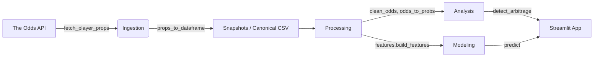

# NBA Odds Data Pipeline & Analysis

A portfolio-ready, end-to-end pipeline that ingests NBA odds from [The Odds API](https://the-odds-api.com/), cleans and enriches the data for analytics, and surfaces actionable signals such as arbitrage opportunities and line discrepancies.

## 🔍 Project Highlights
- **Production-minded ingestion** – configurable API client, reproducible snapshots, and canonical history table.
- **Robust processing layer** – shared helpers for flattening messy sportsbook JSON, handling both decimal and American odds, and devigging probabilities per market.
- **Exploratory & predictive tools** – feature builders, scikit-learn models, and Streamlit visualizations for comparing model projections to market lines.
- **Tested, documented, and reproducible** – curated sample fixtures, pytest coverage, `.env` template, and detailed technical docs in `docs/`.

## 🗺️ Architecture Overview


## 🚀 Getting Started
1. **Install dependencies**
   ```bash
   pip install -r requirements.txt
   ```
2. **Configure API credentials**
   ```bash
   cp .env.example .env
   # edit .env and add your The Odds API key
   ```
3. **Fetch live data**
   ```bash
   python -m src.ingestion
   ```
   This writes timestamped CSV snapshots under `data/` and keeps a canonical history file.

4. **Run the Streamlit dashboard**
   ```bash
   streamlit run web/app.py
   ```
   The app automatically falls back to the curated sample data when no API key is present, so reviewers can explore without credentials.

## 📊 Notebooks & Reproducibility
- Execute `notebooks/player_prop_demo.ipynb` directly, or run it headlessly:
  ```bash
  jupyter nbconvert --ExecutePreprocessor.timeout=600 \
      --to notebook --execute notebooks/player_prop_demo.ipynb \
      --output notebooks/player_prop_demo.ran.ipynb
  ```
- Commit the rendered `.ran` notebook (or HTML export) to showcase outputs without requiring execution.

## ✅ Quality Checks
- Pytest suite validates JSON flattening, odds conversions, and arbitrage detection logic:
  ```bash
  pytest
  ```
- Linting can be added via `ruff` or `flake8` (see docs for suggestions) to extend automated checks.

## 📁 Repository Guide
- `src/ingestion.py` – API client, snapshot utilities, and canonical table management.
- `src/processing.py` – odds flattening, probability math, and convenience wrappers.
- `src/analysis.py` – helper functions for extracting best prices and spotting arbitrage.
- `src/features.py` & `src/modeling.py` – feature engineering and regression models for player props.
- `web/app.py` – Streamlit interface that visualizes line discrepancies and model comparisons.
- `docs/` – deep-dive technical documentation, architecture notes, and future roadmap.

## 🧭 Roadmap
- Extend the Streamlit view with implied edge scoring and alerting.
- Automate daily ingestion with GitHub Actions and persisted S3 storage.
- Add backtesting notebooks that simulate bankroll growth from detected edges.
- Introduce CI checks (lint + tests) to keep the portfolio artifact consistently green.

---

If you review this project as a hiring manager, you can go from clone → run → insight in minutes. The repo highlights pragmatic data engineering, analytical rigor, and a thoughtful developer experience.
